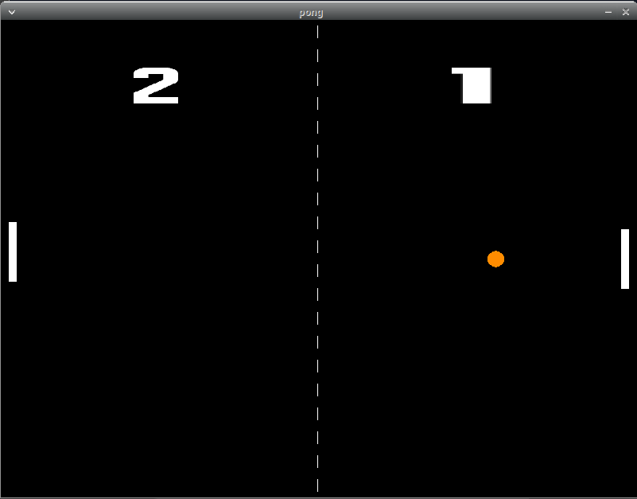

# Pong

Reproduction of the arcade game.

Here is a video of the game running: https://youtu.be/FyqXscHFBu0
## How to execute ?

Use cargo to build/run the project with the following command:
```bash
cargo run --release
```

If an error occur, make sure the following packages are installed on the system:
```bash
sudo apt-get install libsdl2-dev libsdl2-ttf-dev libsdl2-gfx-1.0.0 libsdl2-gfx-dev
```

## Gameplay

Your objective is to score as many goal as possible against the CPU. To add some challenge, when the ball bounces against a racket, its speed increases (to a limit).

The following controls are available:
* up arrow key: move the racket upward.
* down arrow key: move the racket downward.
* ESC key: quit the game.
* space key: restart the game.

## Images

